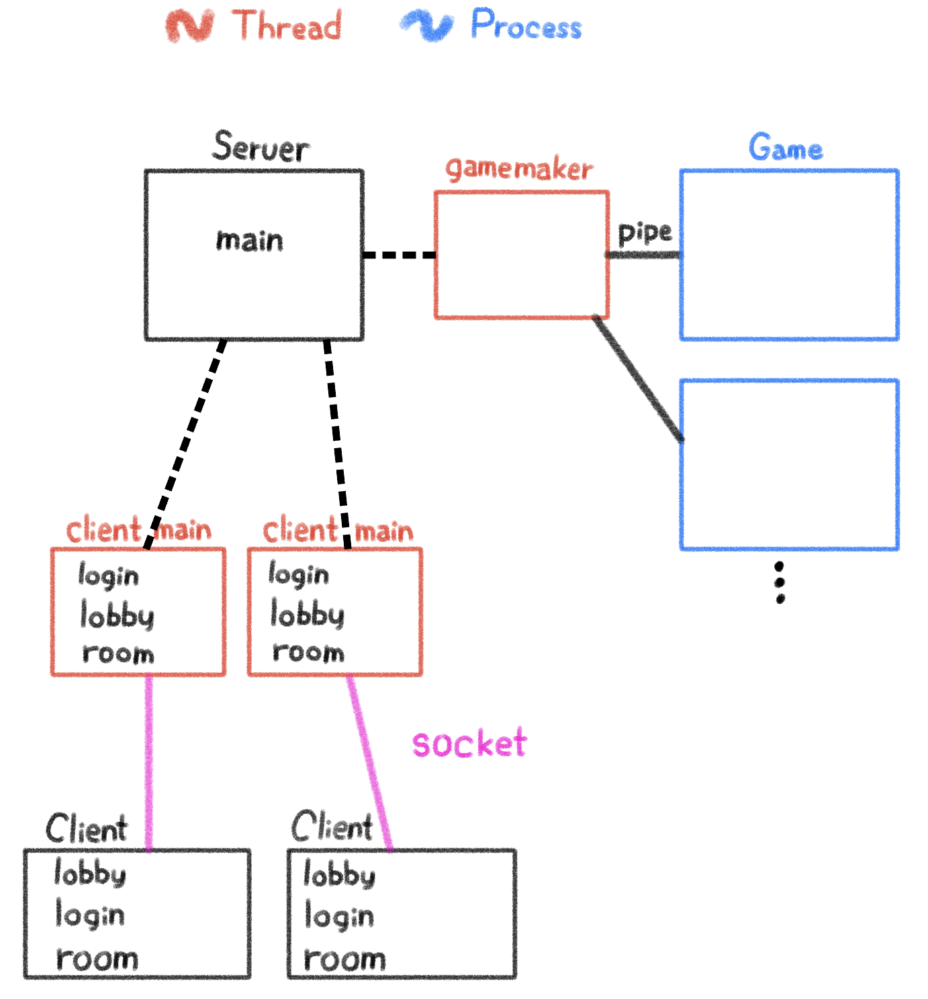
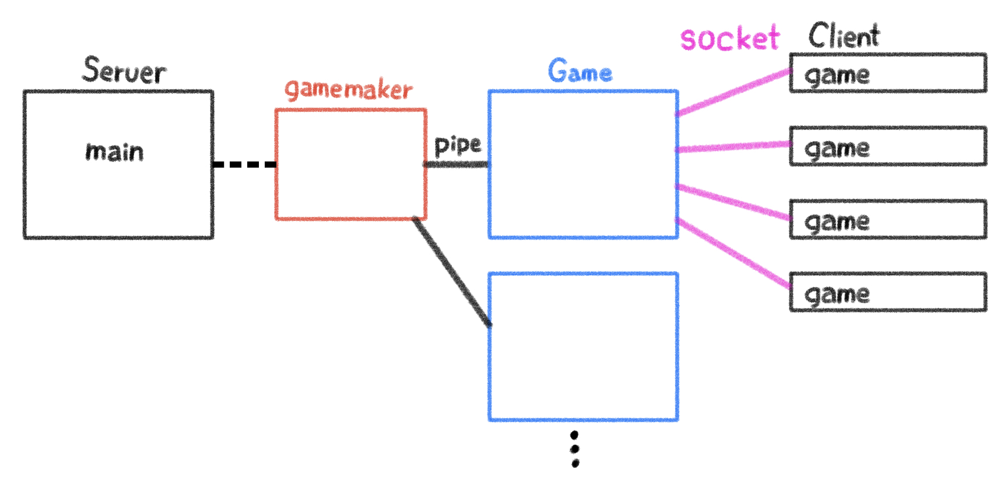

# System Programming Team 7
## Online Blue Marble game

### 프로젝트 설명
> 이 프로젝트는 Server-Client 모델을 통해 사용자에게 Blue Marble 게임을 멀티플레이로 즐길 수 있는 서비스를 제공합니다.
-------------
## MAKEFILE 실행 전 선행 조건  
### MYSQL 설치 및 실행 확인 (이미 설치되어 있으면 생략)
``` sh
$ sudo apt-get update
$ sudo apt-get install mysql-server
$ sudo systemctl status mysql

$ sudo servie mysql start   #mysql이 실행되고 있지 않을 경우 실행
```
### MYSQL 실행 (이미 root의 password가 설정되어 있으면 생략)
처음 시작 시 root의 password는 공백입니다.
root의 password를 설정 해주어야 합니다.
``` sh
#mysql 설치 경로 확인 (가장 처음 경로 사용)
$ whereis mysql
mysql: /usr/bin/mysql /usr/lib/mysql /etc/mysql /usr/include/mysql /usr/share/mysql /usr/share/man/man1/mysql.1.gz

$ sudo /usr/bin/mysql -u root -p
Enter password: [Enter]
```
``` MYSQL
# 5.6 이하
> update user set password=password('0000') where user = 'root';

# 5.7 이상
> update user set authentication_string=password('0000') where user = 'root';

# 8.x 이상
> alter user 'root'@'localhost' identified with mysql_native_password by '0000';

> flush privileges;

> quit
```
### mysql.c, server.c의 mysql connect 정보 수정 (root의 password를 0000으로 바꾸지 않은 경우)
``` C
//mysql.c
char *password = "0000"; //password of the user - 이 부분 수정

//server.c
void mysql_initialization(){
    printf("enter mysql-server password:");
    char buf[100];
    scanf("%s",buf);
    //essencial
    char *server = "localhost";  //server path
    char *user = "root";    //user name
    char *password = "0000"; //password of the user - 이 부분 수정!!

    //optional
    char *database = "BlueMarble";  //DataBase name
    //char *userTable = "user_tb";

    //0. mysql
    if((conn = mysql_init(NULL)) == NULL)
        printf("%s\n",mysql_error(conn));
    
    if(mysql_real_connect(conn, server, user, buf, database, 0, NULL, 0) == NULL){
        mysql_close(conn);
        printf("%s\n",mysql_error(conn));
    }
}


```
-------------
## MAKEFILE 실행 설명
``` sh
$ makefile
```
### 1. 실행 파일 이름: mysql_init
* 이 실행 파일을 실행하면 Server에서 필요한 MYSQL의 임시 데이터를 생성합니다.  
    * user_tb table은 유저 로그인 등에 필요한 유저 정보를 담고 있습니다.  
    * lobby table은 각 게임방에 대한 정보를 담고 있습니다. lobby 생성 및  수정에 사용할 예정이었으나 현재는 초기화에만 사용되고 있습니다.

``` sh
$ ./mysql_init

#BlueMarble DB가 없을 경우
*****************mysql_init()*****************

*************mysql_real_connect()*************

************CREATE Database & Table************


*****************user_tb init*****************
INSERT INTO user_tb (userid, userpw, username, userphone) VALUES('test1', '1111', 'Aerial', '010-1111-1111')
INSERT INTO user_tb (userid, userpw, username, userphone) VALUES('test2', '2222', 'Cordelia', '010-2222-2222')
INSERT INTO user_tb (userid, userpw, username, userphone) VALUES('test3', '3333', 'Macbeth', '010-3333-3333')
INSERT INTO user_tb (userid, userpw, username, userphone) VALUES('test4', '4444', 'Hamlet', '010-4444-4444')
INSERT INTO user_tb (userid, userpw, username, userphone) VALUES('test5', '5555', 'Othello', '010-5555-5555')

******************lobby init******************
INSERT INTO lobby (title, access, users) VALUES('Room 1', 1, 0)
INSERT INTO lobby (title, access, users) VALUES('Room 2', 1, 0)
INSERT INTO lobby (title, access, users) VALUES('Room 3', 1, 0)
INSERT INTO lobby (title, access, users) VALUES('Room 4', 1, 0)
INSERT INTO lobby (title, access, users) VALUES('Room 5', 1, 0)
INSERT INTO lobby (title, access, users) VALUES('Room 6', 1, 0)
INSERT INTO lobby (title, access, users) VALUES('Room 7', 1, 0)
INSERT INTO lobby (title, access, users) VALUES('Room 8', 1, 0)
INSERT INTO lobby (title, access, users) VALUES('Room 9', 1, 0)
INSERT INTO lobby (title, access, users) VALUES('Room 10', 1, 0)
INSERT INTO lobby (title, access, users) VALUES('Room 11', 1, 0)
INSERT INTO lobby (title, access, users) VALUES('Room 12', 1, 0)
INSERT INTO lobby (title, access, users) VALUES('Room 13', 1, 0)
INSERT INTO lobby (title, access, users) VALUES('Room 14', 1, 0)
INSERT INTO lobby (title, access, users) VALUES('Room 15', 1, 0)
INSERT INTO lobby (title, access, users) VALUES('Room 16', 1, 0)
INSERT INTO lobby (title, access, users) VALUES('Room 17', 1, 0)
INSERT INTO lobby (title, access, users) VALUES('Room 18', 1, 0)
INSERT INTO lobby (title, access, users) VALUES('Room 19', 1, 0)
INSERT INTO lobby (title, access, users) VALUES('Room 20', 1, 0)

#BlueMarble DB가 있을 경우
*****************mysql_init()*****************

*************mysql_real_connect()*************

************CREATE Database & Table************
● Database BlueMarble is already created

Drop Database BlueMarble? [y|Y for yes, others for no]: 
#y|Y 입력시 위와 결과 동일

#BlueMarble DB가 존재하고 이미 user_tb이나 lobby table이 존재할 경우
● Table user_tb is already created

Drop Table user_tb? [y|Y for yes, others for no]: 
#y|Y 선택시
mysql> DROP TABLE user_tb;
mysql> CREATE TABLE user_tb;

● Table lobby is already created

Drop Table lobby? [y|Y for yes, others for no]: 
#y|Y 선택시
mysql> DROP TABLE lobby;
mysql> CREATE TABLE lobby;

#y|Y 를 선택하여 새로 만들어진 table만 초기화를 합니다.
``` 
>mysql_init 이 정상적으로 작동하지 않을 경우 다음 코드를 실행해 주세요.
``` sh
$ mysql -u root -p
Enter password: 0000 | [your_root_password]

> create database BlueMarble;
> use BlueMarble;

> create table user_tb(
    useridx int primary key auto_increment,
    userid varchar(300) unique not null,
    userpw varchar(300) not null,
    username varchar(300) not null,
    userphone varchar(300),
    useremail varchar(300),
    regdate datetime default now()
    );

> create table lobby(
    id int primary key auto_increment,
    title varchar(300) unique not null,
    access int,
    users int
    );

> INSERT INTO user_tb (userid, userpw, username, userphone) VALUES
('test1', '1111', 'test1', '010-1111-1111'),
('test2', '2222', 'test2', '010-2222-2222'),
('test3', '3333', 'test3', '010-3333-3333'),
('test4', '4444', 'test4', '010-4444-4444'),
('test5', '5555', 'test5', '010-5555-5555');

> INSERT INTO lobby (title, access, users) VALUES
('Room 1', 1, 0),
('Room 2', 1, 0),
('Room 3', 1, 0),
('Room 4', 1, 0),
('Room 5', 1, 0),
('Room 6', 1, 0),
('Room 7', 1, 0),
('Room 8', 1, 0),
('Room 9', 1, 0),
('Room 10', 1, 0),
('Room 11', 1, 0),
('Room 12', 1, 0),
('Room 13', 1, 0),
('Room 14', 1, 0),
('Room 15', 1, 0),
('Room 16', 1, 0),
('Room 17', 1, 0),
('Room 18', 1, 0),
('Room 19', 1, 0),
('Room 20', 1, 0);
```
### 2. 실행 파일 이름: server
* 이 실행 파일을 실행하면 Blue Marble Game의 Server가 실행됩니다. Server는 실행 중에 실행 확인에 필요한 각종 디버깅 메세지를 출력합니다.  

### 3. 실행 파일 이름: client
* 이 샐행 파일을 실행하면 Blue Marble Game의 Client를 실행합니다.
------------
## Server - Client Model 구조 설명
### 1. 


------------
## Server 기능

------------
## Client 기능
